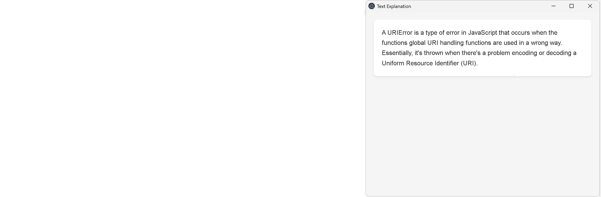

# Screen Explain

Quickly learn about any text on your screen!

An Electron-based desktop application that captures screen content and explains it using OCR and AI.

When triggered with CTRL+L (CMD+L on Mac), it allows users to select a portion of their screen, processes the text content using Tesseract OCR, and provides an AI-generated explanation using OpenAI's GPT-4.

This can be useful for quickly looking up anything, especially if the text is in an unselectable window, such as error messages or frustrating websites.

## Features

Cross-platform support (Windows & Mac)

### Building the Application

From your cmd.exe prompt, in the project folder, type:
npm start                  # Runs the application from cmd prompt
npm run package-win-msi    # Creates msi executables for windows (or use -nsis, -portable, -all)
npm run package-mac        # Creates executables for mac

## Application Architecture

The application follows a modular architecture where each class handles a specific responsibility in the screen capture and processing pipeline. Here's how the process flows through Main.ts:

1. **Main Class (`Main.ts`)**
   - Central coordinator for all functionality
   - Initializes all components and manages the application lifecycle
   - Orchestrates the sequence of operations through `awaitSequence()`

2. **Process Flow**
   - **ScreenListener**: Waits for CTRL+L/CMD+L hotkey and captures initial screenshot
   - **ScreenCropper**: Displays selection interface and handles area cropping
   - **ProcessWindow**: Shows status updates during processing
   - **OCRProcessorGoogle**: Extracts text from the cropped image using Google
   - **OCRProcessorLocal**: Extracts text from the cropped image using Tesseract if no Google credentials are supplied
   - **OpenAiSimpleStream**: Processes text through GPT-4 for explanation
   - **ExplanationWindow**: Displays the AI-generated explanation

## Future Ideas
1. Add text to individual queries, after pressing CTRL+L but before drawing your green box
2. Image recognition and discussion

## Contributing
Contributions are welcome! Please feel free to submit a Pull Request.